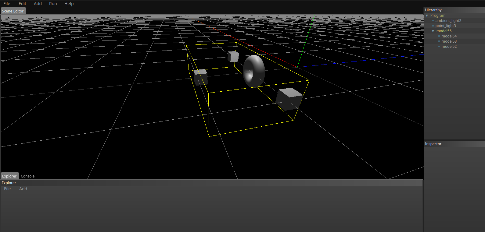
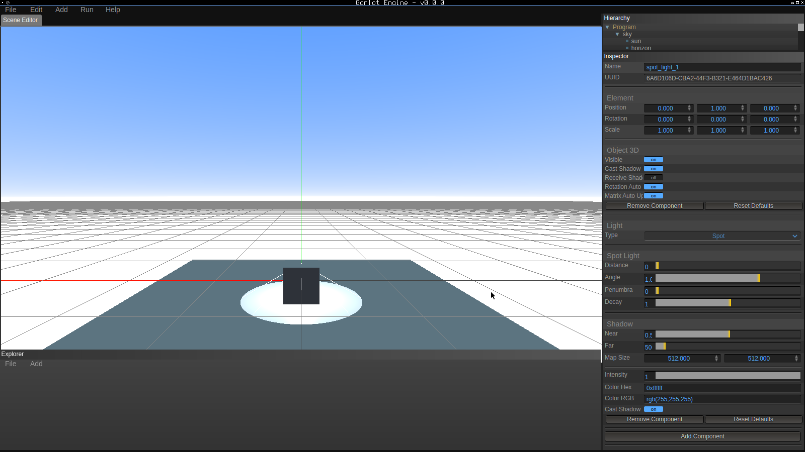
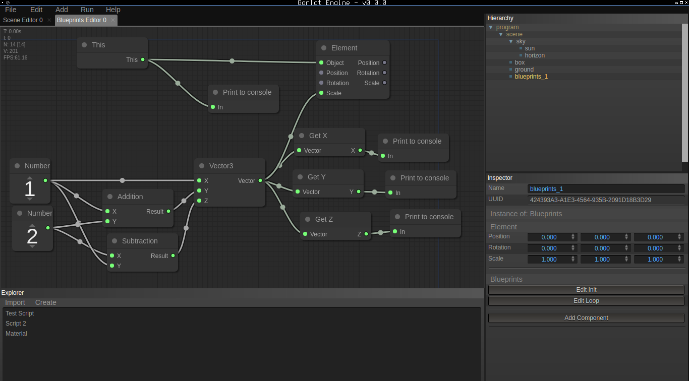
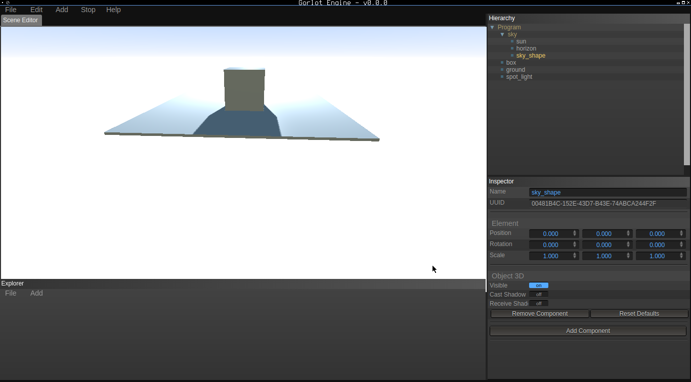
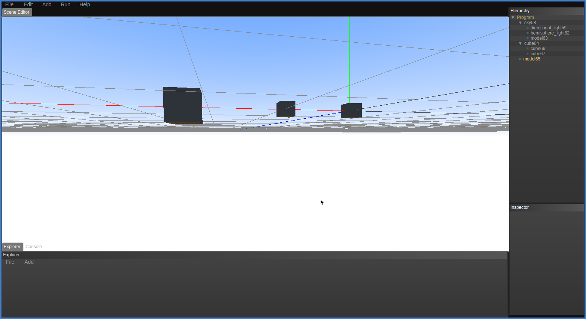
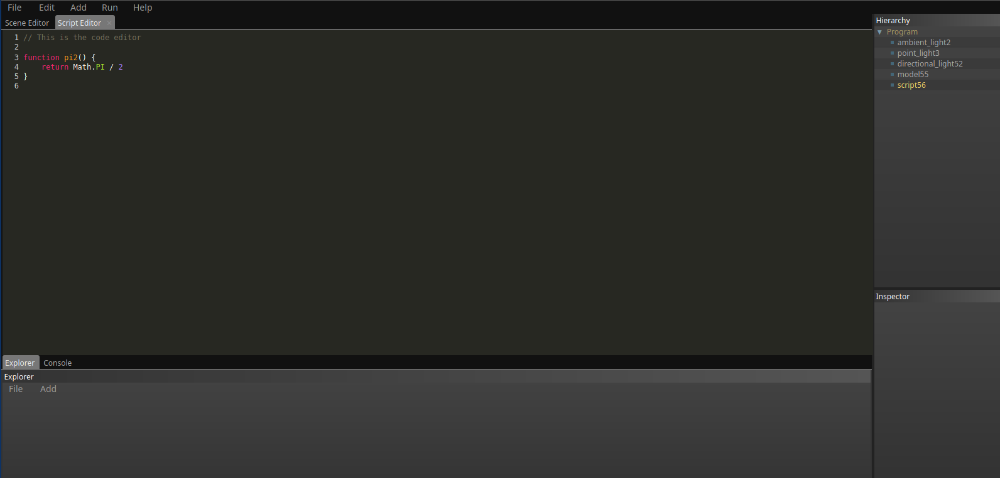

# Gorlot Engine

Gorlot Engine is a 3D Game engine coded in JavaScript, based in Three.JS and nunuStudio.

## Screenshots

## Technologies used
[litegui.js: The graphical interface](https://github.com/jagenjo/litegui.js)

[litegraph.js: The nodes library](https://github.com/jagenjo/litegraph.js)

[cannon.js: The physics system](https://schteppe.github.io/cannon.js/)

[jsColor](http://jscolor.com)

[Three.js: The 3D Library](https://github.com/mrdoob/three.js)

[CodeMirror: The code editor](http://codemirror.net)

[nunuStudio](https://nunuStudio.org)